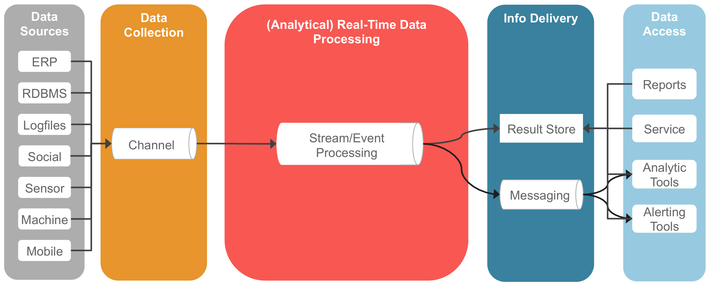

# 数据架构（Data Architecture）

## Architecture

- 数据源、数据集成
- 存储：分析型、消息系统
- 计算：批处理、流处理
- 调度：资源、作业
- 业务流程

### Traditional Architecture

### Streaming Architecture

### Lambda Architecture

### Kappa Architecture

### Unified Architecture

### IoT Architecture

## Reference

- [Big Data Architectures(Microsoft)](https://docs.microsoft.com/en-us/azure/architecture/data-guide/big-data/)
- Big Data Architecture and Patterns Series(IBM):
    * [Part 1: Introduction to big data classification and architecture](http://www.ibm.com/developerworks/analytics/library/bd-archpatterns1/index.html)
    * [Part 2: How to know if a big data solution is right for your organization](http://www.ibm.com/developerworks/analytics/library/bd-archpatterns2/index.html)
    * [Part 3: Understanding the architectural layers of a big data solution](http://www.ibm.com/developerworks/analytics/library/bd-archpatterns3/index.html)
    * [Part 4: Understanding atomic and composite patterns for big data solutions](http://www.ibm.com/developerworks/analytics/library/bd-archpatterns4/index.html)
    * [Part 5: Apply a solution pattern to your big data problem and choose the products to implement it](http://www.ibm.com/developerworks/analytics/library/bd-archpatterns5/index.html)
- [The Framework for Enterprise Architecture: Background, Description and Utility by: John A. Zachman](https://www.zachman.com/resources/ea-articles-reference/327-the-framework-for-enterprise-architecture-background-description-and-utility-by-john-a-zachman)