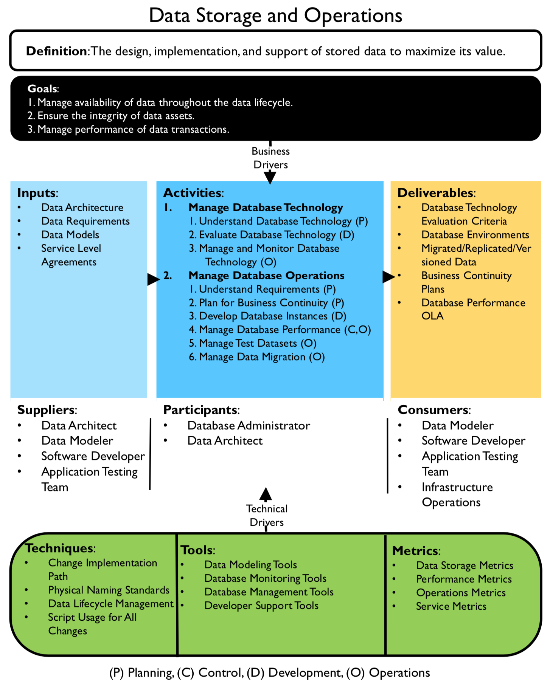

# 数据存储与操作（Data Storage & Operations）

## 非关系型数据和NoSQL（Non-relational data and NoSQL）

| 要求 | 文档数据 | 列系列数据 | 键/值数据 | 图形数据 | 时序数据 | 对象数据 | 外部索引数据 |
| --- | --- | --- | --- | --- | --- | --- | --- |
| 规范化 | 非规范化 | 非规范化 | 非规范化 | 规范化 | 规范化 | 非规范化 | 非规范化 |
| 架构 | 基于读取的架构 | 列系列定义基于写入，列架构基于读取 | 基于读取的架构 | 基于读取的架构 | 基于读取的架构 | 基于读取的架构 | 基于写入的架构 |
| 一致性（跨并发事务） | 可调式一致性，文档级别保证 | 列系列级别保证 | 键级别保证 | 图形级别保证 | 不适用 | 不适用 | 不适用 |
| 原子性（事务范围） | 集合 | 表 | 表 | 图形 | 不适用 | 对象 | 不适用 |
| 锁定策略 | 乐观（无锁） | 悲观（行锁） | 乐观 (ETag) | 不适用 | 悲观（Blob 锁） | 不适用 |
| 访问模式 | 随机访问 | 对高/宽数据进行聚合 | 随机访问 | 随机访问 | 随机访问和聚合 | 顺序访问 | 随机访问 |
| 索引 | 主要和辅助索引 | 主要和辅助索引 | 仅主要索引 | 主要和辅助索引 | 主要和辅助索引 | 仅主要索引 | 不适用 |
| 数据形状 | 文档 | 列系列包含列的表格 | 键和值 | 包含边缘和顶点的图形 | 表格 | Blob 和元数据 | 文档 |
| 稀疏 | 是 | 是 | 是 | 否 | 否 | 不适用 | 否 |
| 宽（很多列/属性） | 是 | 是 | 否 | 否 | 否 | 是 | 是 |  
| 基准大小 | 小 (KB) 到中（低 MB） | 中 (MB) 到大（低 GB） | 小 (KB) | 小 (KB) | 小 (KB) | 大 (GB) 到极大 (TB) | 小 (KB) |
| 总体最大规模 | 极大 (PB) | 极大 (PB) | 极大 (PB) | 大 (TB) | 大（低 TB）  | 极大 (PB) | 大（低 TB） |

## Reference

- [Non-relational data and NoSQL](https://docs.microsoft.com/en-us/azure/architecture/data-guide/big-data/non-relational-data)