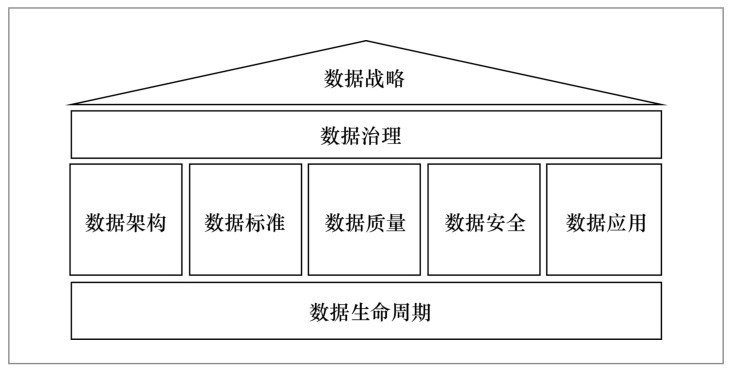
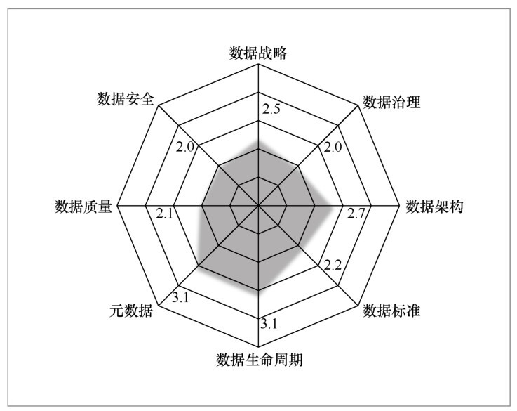

# DCMM

数据管理能力成熟度评估模型（Data Management Capability Maturity Assessment Model）

## 能力域和能力项

| 能力域 | 能力项 |
| :---- | :---- |
| 数据战略 | 数据战略规划 数据战略实施 数据战略评估 |
| 数据治理 | 数据治理组织 数据制度建设 数据治理沟通 |
| 数据架构 | 数据模型 数据分布 数据集成与共享 元数据管理 |
| 数据应用 | 数据分析 数据开放共享 数据服务 |
| 数据安全 | 数据安全策略 数据安全管理 数据安全审计 |
| 数据质量 | 数据质量需求 数据质量检查 数据质量分析 数据质量提升 |
| 数据标准 | 业务术语 参考数据与主数据 数据元 指标数据 |
| 数据生命周期 | 数据需求 数据设计与开发 数据运维 数据退役 |

## 成熟度评估等级

- 初始级

  数据需求的管理主要是在项目级体现，没有统一的管理流程，主要是被动式管理

- 受管理级

  组织已意识到数据是资产，根据管理策略的要求制定了管理流程，指定了相关人员进行初步管理

- 稳健级

  数据已被当作实现组织绩效目标的重要资产，在组织层面制定了系列的标准化管理流程，促进数据管理的规范化

- 量化管理级

  数据被人为之获取竞争优势的重要资源，数据管理的效率能量化分析和监控

- 优化级

  数据被认为是组织生存和发展的基础，相关管理流程能实时优化，能在行业内进行最佳实践分享
  

## Reference

- [数据管理能力成熟度评估模型(Data management capability maturity assessment model)](http://www.gb688.cn/bzgk/gb/newGbInfo?hcno=B282A7BD34CAA6E2D742E0CAB7587DBC)
- [数据管理能力成熟度模型](http://www.infocomm-journal.com/bdr/CN/abstract/abstract165784.shtml)
